# 🤖🎙️ Smart Scheduler AI Agent

**Smart Scheduler AI Agent** provides a natural, voice-enabled, multi-turn conversation to help users find free slots and schedule meetings via Google Calendar.

Built with **LLMs (Gemini API)**, **Google Calendar API**, real-time **Speech Recognition (STT)**, via Google Cloud and **Text-to-Speech (TTS)** via Eleven Labs APIs, the system showcases conversational memory, calendar integration, and advanced voice-based interaction.


## ✅ Features Implemented

| Requirement                                         | Status |
| --------------------------------------------------- | :----: |
| Multi-turn, back-and-forth conversation             |   ✅   |
| Understands user intent for scheduling              |   ✅   |
| Clarifies missing details (duration, day, time)     |   ✅   |
| Google Calendar Integration to check availability   |   ✅   |
| LLM (Gemini API) used for natural conversation      |   ✅   |
| Voice interface (microphone + TTS)                  |   ✅   |
| Low Latency Spoken Conversation                     |   ✅   |
| Turn-based audio loop (prevents feedback loops)     |   ✅   |
| Graceful conflict resolution (suggests alternatives)|   ✅   |
| Smarter Time Parsing (e.g., 'day after tomorrow')   |   ✅   |
| Dynamic rescheduling mid-conversation               |   ✅   |
| Scheduling the meeting in Google Calander           |   ✅   |


## 🏗️ Architecture Overview

```mermaid
graph TD
    A[🎙️ Microphone Input] --> B[📝 Google Cloud Speech-to-Text]
    B --> C[📝 Transcribed User Text]
    C --> D[🤖 Gemini API - LLM]
    D -->|Tool: get_free_slot| E1[Free Slots]
    D -->|Tool: parse_datetime| E2[Date and Time]
    D -->|Tool: book_meeting| E3[Meeting Link]
    E1 --> D
    E2 --> D
    E3 --> D
    D --> F[💬 AI-generated Response]
    F --> G[🔊 Eleven Labs Text-to-Speech]
    G --> H[🎧 Play Response]
    H --> A
```




## 📚 Features Breakdown

### 🎤 Voice Recognition
- Real-time streaming recognition with Google Cloud Speech-to-Text
- Auto-stop listening after user finishes speaking
- Doesn't listen during TTS playback (prevents accidental input from responses)

### 🧠 Conversational Intelligence (LLM)
- Built on Gemini API for:
  - Understanding meeting requests
  - Asking for missing info (e.g., "What day works for you?")
  - Summarizing slots and options

### 📅 Google Calendar Integration
- Checks real calendar availability using Google Calendar API
- Suggests alternative slots when conflicts arise
- Supports complex time requests like:
  - "day after tomorrow at 1 PM"
  - "evening on Tuesday"
- Schedules the meeting on the desired date, time and slot.

### 🗣️ Voice Output (TTS)
- Uses Eleven Labs Text-to-Speech (TTS) for human-like responses
- Natural turn-taking: plays response, then resumes listening

### ♻️ Stateful & Dynamic
- Maintains conversation context (meeting duration, day preference, time slots, etc.)
- Can update parameters mid-conversation (e.g., changing meeting length)


## ⚡ Advanced Features

- ✅ Conflict Resolution: Suggests alternate slots gracefully
- ✅ Relative Time Understanding: Handles phrases like "day after tomorrow", "evening"
- ✅ Dynamic Update Mid-Conversation: "Actually, make that 2 hours" → works!
- ✅ Turn-Based Voice Loop: Clean conversational cycles
- ✅ Low -Latency: The conversation feels natural
- ✅ Exit Command: Say 'exit' anytime to end the session


## ✨ Design Choices

- Used Gemini API for flexible, contextual conversation handling.
- Used Google Cloud's Speech-to-Text (Streaming) for real-time transcriptions.
- Used Eleven Lab's Text-to-Speech + pygame for smooth audio playback.
- Handled edge cases like empty responses, audio errors, or ambiguous time requests.
- Focused on real-time conversational flow — fast responses, no awkward pauses.


## 📂 Repository Structure

```
├── main.py              # Voice input/output + scheduling logic
├── agent.py             # Gemini API interaction for conversational logic
├── calendar_service.py  # Google Calendar API integration
├── tools.py             # Utility tools for time parsing and slot finding
├── requirements.txt     # Python dependencies
├── README.md            # This file
```
